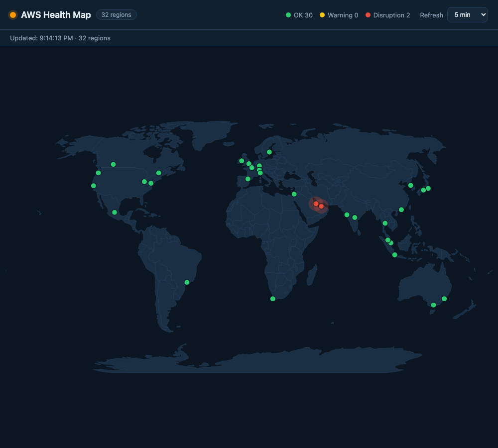

# AWS Health Map

A world map that plots AWS regions and shows the live AWS Health status of each
region as a traffic-light dot (green = OK, yellow = degraded, red = disruption).

The frontend is a React + Vite single-page app. A tiny Node server (no
framework) serves the built assets and proxies the AWS Health feed
server-to-server, so the browser never hits AWS directly (no CORS) and the
response is briefly cached.



## Requirements

- Node.js 20+ (the Docker image uses Node 22)

## Install

```bash
npm install
```

## Develop

Starts the Vite dev server with hot reload:

```bash
npm run dev
```

## Build

Produces the optimized frontend in `dist/`:

```bash
npm run build
```

## Run

Build first, then start the production Node server, which serves `dist/` and
exposes `/api/health`:

```bash
npm run build
node server.js
```

The app is then available at http://localhost:8080.

### Configuration

The server reads these environment variables:

| Variable         | Default                                    | Description                          |
| ---------------- | ------------------------------------------ | ------------------------------------ |
| `PORT`           | `8080`                                     | Port the server listens on           |
| `AWS_HEALTH_URL` | `https://status.aws.amazon.com/data.json`  | Upstream AWS Health feed             |
| `CACHE_TTL_MS`   | `30000`                                    | How long the AWS response is cached  |

## Run with Docker

```bash
docker compose up --build
```

This builds the frontend and runs the Node server in a slim image, published on
port 8080 with a healthcheck on `/healthz`.

## Endpoints

- `/` — the map UI (served from `dist/`)
- `/api/health` — cached, server-side proxy of the AWS Health feed (JSON)
- `/healthz` — liveness probe, returns `ok`
